# 1. Network application

**Цель работы:** Освоение набора системных вызовов для создания
socket-соединений различных типов для обмена данными на хостах и по сети.

*См. отчет по предмету "Операционные системы*

# 2. L4 Socket sample

**Цель работы:** Создание клиент-серверных приложений, взаимодействующих
друг с другом по сети на основе технологии соединения на сокетах L4.

*См. отчет по предмету "Операционные системы*

# 3. GnuPG tool utilisation 1

## 1. Цель работы 

Установка утилиты GnuPG, исследование ее режимов работы с различными опциями и ключами и выполнение команд из базового списка.

## 2. Ход работы

Данная работа выполнялась на ОС Ubuntu 20.04.6 на WSL (Windows Subsystem for Linux).

## 3. Установка GNU PG2

Установим GNU PG2 (GPG2):

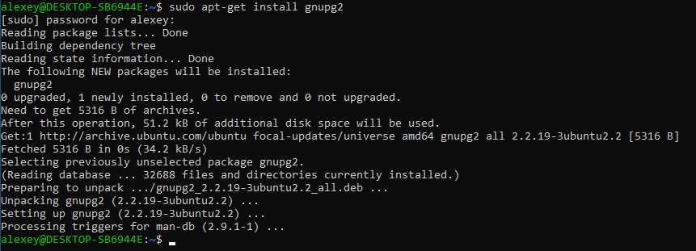

Выведем информацию о текущей версии GPG2:

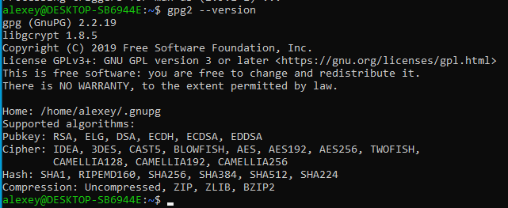

## 4. Генерация ключей

Сгенерируем ключи для шифрования и подписи (тип 1), размером 4096 и бесконечным временем жизни:

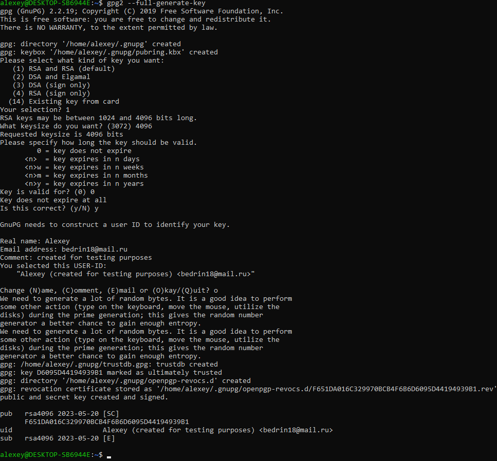

Убедимся в том, что ключ действительно создан и распознан GPG2:

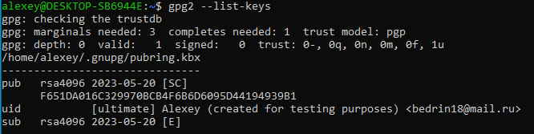

Действительно, сгенерированный ключ появился в списке. Выведем отпечаток ключа - в дальнейшем он потребуется для проверки корректности импорта ключа с сервера:

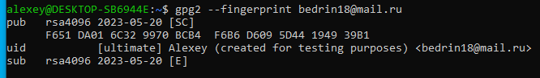

Проверим структуру папки .gnupg после генерации ключей. Для этого воспользуемся утилитой tree, которая строит файловую структуру заданной папки в удобном визуальном формате:

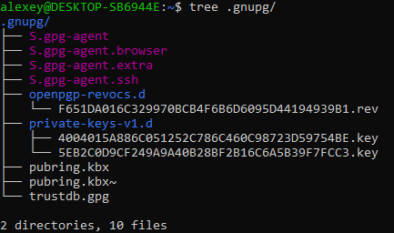

В полученной структуре можно заметить следующие объекты:

- Каталог, хранящий в себе открытые ключи (opengp-revocs.d);
- Каталог, хранящий в себе приватные ключи (private-keys-v1.d);
- Зашифрованный файл - связку открытых ключей (pubring.kbx);
- Файл с доверительной базой данных (trustdb.gpg).

## 5. Шифрация и дешифрация файла

Создадим документ с произвольным текстом для дальнейшей работы с ним:

Зашифруем созданный файл созданным ранее ключом:

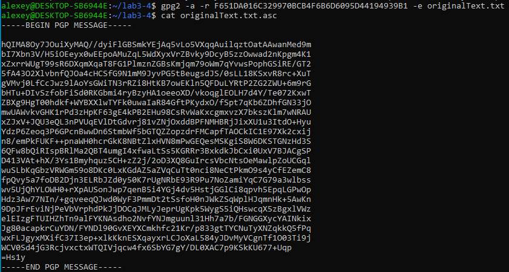

Дешифруем полученный файл тем же ключом, сравним исходный и полученный файлы:

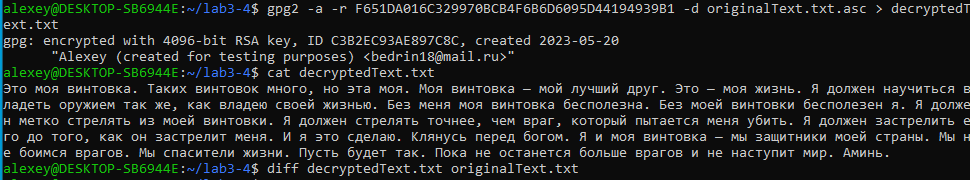

Различий между исходным файлом и результирующим файлом нет, что свидетельствует об успешном процессе шифрации и дешифрации.

## 6. Создание цифровой подписи

Создадим новый файл, сгенерируем к нему цифровую подпись:

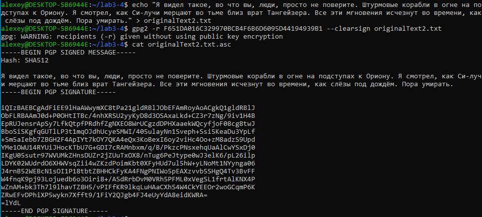

Проверим полученную цифровую подпись:

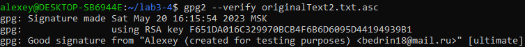

Полученный результат "Good signature" свидетельствует о том, что подписанному документу был найден соответствующий ключ из хранилища.

## 7. Исследование прочих команд GPG2

При помощи GPG2 возможна и более тонкая настройка ключа при его создании при добавлении флага **--expert**. Попробуем создать ещё один ключ подобным образом:

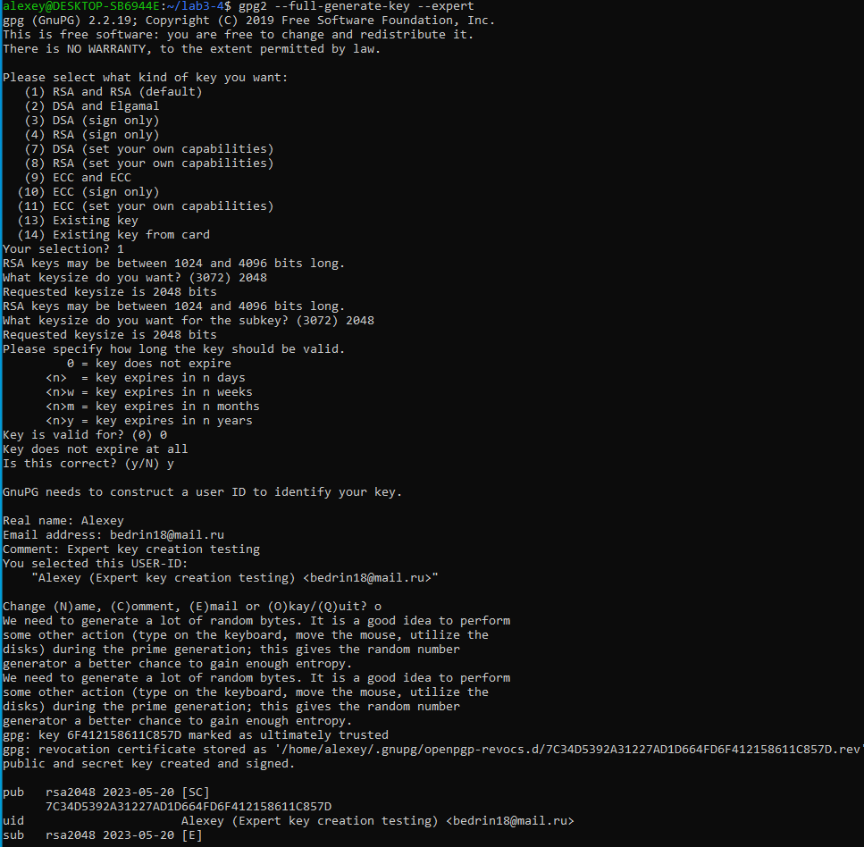

Очевидно, что помимо добавления и создания ключей доступна операция их удаления из хранилища. Попроуем удалить созданные нами ключи в правильном порядке: сначала приватные, затем связанные с ними публичные:

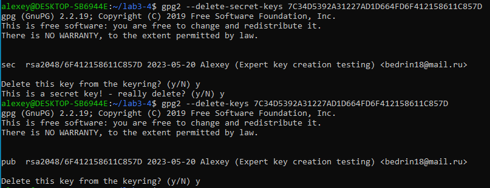

## 8. Выводы

В рамках данной работы были изучены основы работы с GPG: создание и удаления пар ключей (публичный/приватный), шифрация и дешифрация файлов при помощи ключей, создание электронной подписи файла и её проверка.

# 4. GnuPG tool utilisation 2

## 1. Цель работы

Импорт и экспорт ключей (цифровых подписей), шифрование сообщений с помощью цифровых подписей.

## 2. Ход работы

Данная работа выполнялась на ОС Ubuntu 20.04.6 на WSL (Windows Subsystem for Linux).

## 3. Создание и использование электронной цифровой подписи (ЭЦП)

Шифрация файлов и проверка подписей может осуществляться при помощи открытого ключа. Для дальнейшей работы используется ключ, созданный в предыдущей лабораторной работе:

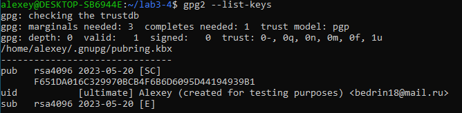

Экспортируем данный ключ в внешний файл:

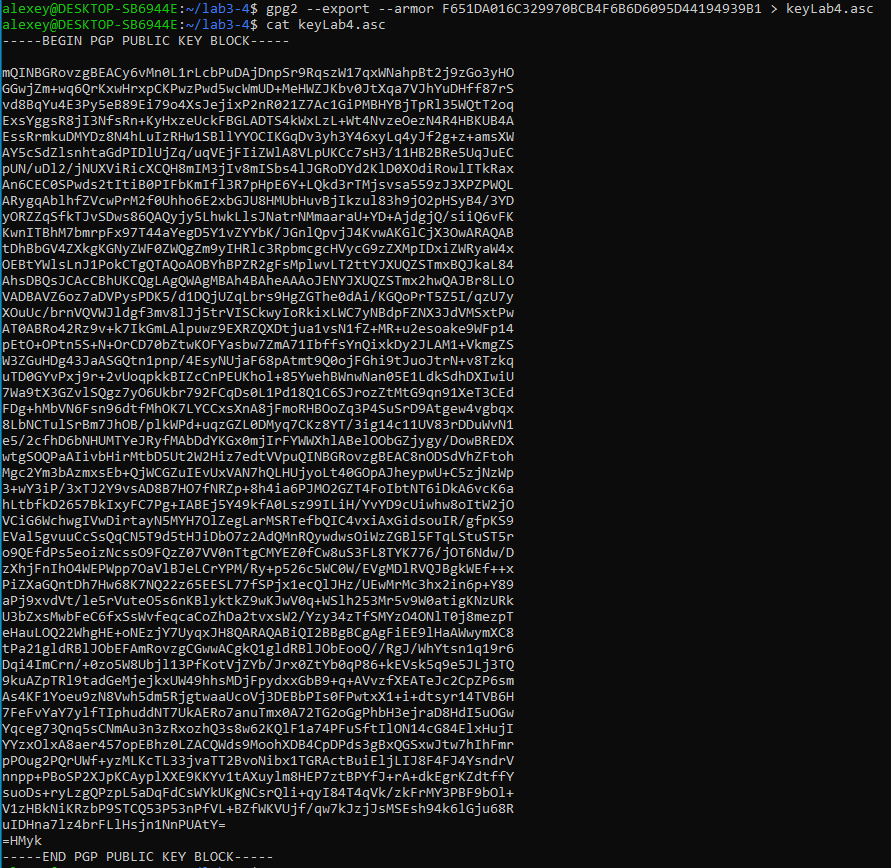

Создадим новый файл для дальнейшей работы с ним:

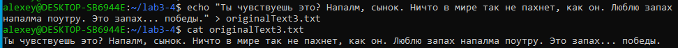

Создадим для него отсоединённую ЭЦП в текстовом формате:

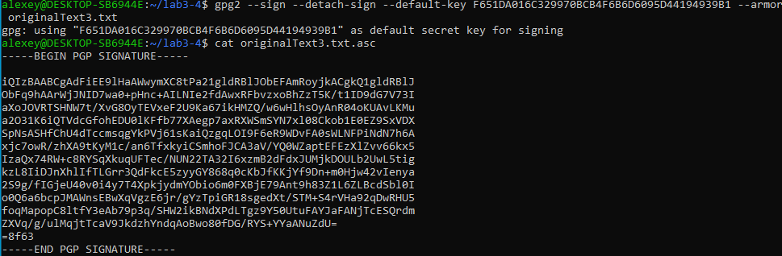

Аналогичным образом, создадим отсоединённую ЭЦП в бинарном формате:

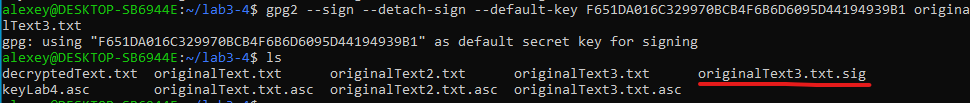

После выполнения команды произошло создание файла ЭЦП originalText3.txt.sig, который и является отсоединённой ЭЦП.

Создадим встроенную в файл ЭЦП в текстовом формате:

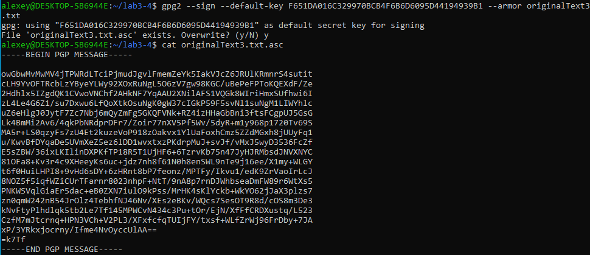

Аналогичным образом, создадим встроенную ЭЦП в бинарном формате:

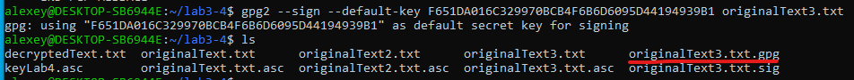

После выполнения команды произошло создание файла originalText3.txt.gpg.

## 4. Импорт и экспорт ключей

Предварительно отчистив хранилище ключей, импортируем созданный ранее ключ и убедимся в корректности его импорта:

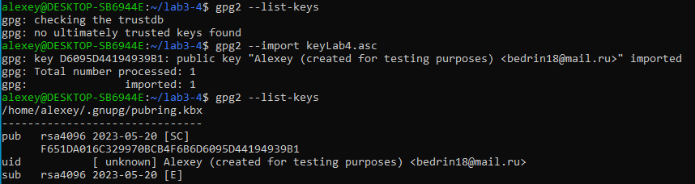

Отредактируем импортированный ключ - установим к нему доверие, что потребуется для дальнейшей проверки ЭЦП:

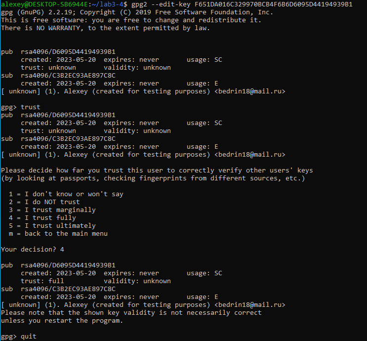

Теперь, при наличии импортированного доверенного ключа, проверим отсоединённую ЭЦП из предыдущего пункта:

Полученный результат - Good signature - свидетельствует о том, что ключ соответствует использованному при генерации ЭЦП.

Экспортируем этот же ключ на внешний сервер keyserver.ubuntu.com, убедимся в том, что ключ действительно находится на сервере:

Первая полученная ошибка может быть объяснена тем, что сервер не успел так быстро обработать полученный ключ - поэтому первый запрос ключа закончился получением ошибки, а второй прошёл успешно.

Импортируем экспортированный ранее ключ:

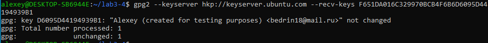

Полученный с сервера ключ соответствует имеющемся, о чём говорит строка unchanged: 1 в результате.

## 5. Выводы

В рамках данной работы были изучены основные способы генерации встроенных и отсоединённых ЭЦП при помощи GPG2. Также был получен практический опыт по импорту и экспорту ключей как в отдельный файл, так и на внешний сервер.

# 5. WireShark packet sniffing

## 1. Цель работы

Изучение основных способов поиска уязвимостей в сети по анализу сетевого трафика с помощью программы анализатора
Wireshark.

## 2. Ход работы

Данная работа осуществлялись на машине, подключенной к домашней сети со следующей конфигурацией:

- Локальный IPv6-адрес канала: `fe80::3a0e:bb5b:597d:e57b%11`
- IPv4-адрес: `192.168.1.38`
- Маска подсети: `255.255.255.0`
- Основной шлюз: `192.168.1.1`
- MAC-адрес: `28-D0-EA-DE-DB-CC`

## 3. Анализ ICMP-трафика

Протокол ICMP (Internet Control Message Protocol) предназначен для решения задач управления, тестирования, мониторинга
сети и нотификации об ошибках и проблемах связанных с сетью.

Трафик протокола ICMP порождается такими утилитами как например `ping` или `traceroute`.

## 3.1 ping

Утилита `ping` отправляет запросы (Echo-Request) протокола ICMP указанному узлу сети и фиксирует поступающие ответы
(Echo-Reply). Время между отправкой запроса и получением ответа (RTT) позволяет определять двусторонние задержки по
маршруту и частоту потери пакетов, т.е. косвенно определять загруженность на каналах передачи данных и промежуточных
устройствах.

Wireshark — программа-анализатор трафика компьютерных сетей. Данная программа может отслеживать весь сетевой трафик
в режиме реального времени, переводя сетевую карту в promisc mode (принятие всех сетевых пакетов вне зависимости от их
адресата). Т.к. ICMP является сетевым протоколом, то Wireshark может отслеживать соответствующий трафик.

Для того чтобы отследить ICMP-трафик, требуется предварительно запустить отслеживание пакетов в Wireshark.

Для генерации ICMP трафика использовалась команда `ping github.com`:

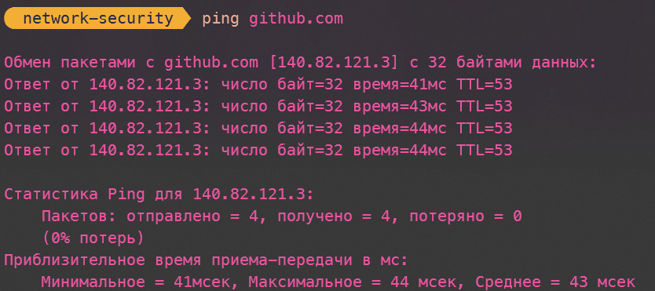

Было отправлено 4 эхо-запроса и получено 4 эхо-ответа. Соответствующий трафик был отслежен в Wireshark:

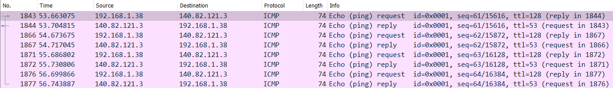

В отчете Wireshark видно 8 пакетов, о каждом из которого приведена краткая информация:

- IP-адрес отправителя пакета;
- IP-адрес получателя пакета;
- используемый протокол передачи данных;
- длинна пакета данных;
- информация, специфичная для используемого протокола.

Для каждого отслеженного пакета можно посмотреть более детальную информацию:

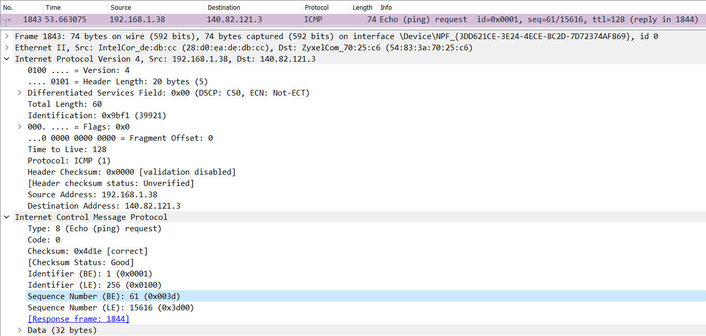

В детальном отчете о первым пакете можно увидеть следующую информацию:

- IP-адрес отправителя пакета: `192.168.1.38`;
- IP-адрес получателя пакета: `140.82.121.3`;
- количество хопов до получателя (ttl): `128`;
- тип протокола пакета: `ICMP`;
- тип icmp-пакета: `8` (пакет является эхо-запросом);
- код (подтип ICMP пакета): `0` (не важен для эхо-запросов);
- идентификатор (используется для сопоставления запроса с ответом): `1`;
- номер последовательности (используется для сопоставления запроса с ответом): `61`;
- контрольная сумма (используется для проверки ошибок передачи данных): `0x4d1e`.

Следом за эхо-запросом в отчете Wireshark можно увидеть пакет с соответствующим эхо-ответом:

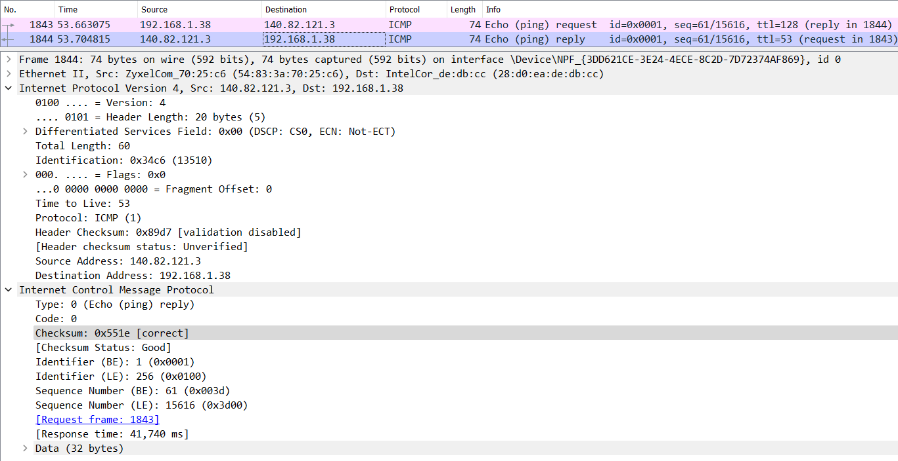

В детальном отчете о втором пакете можно увидеть следующую информацию:

- IP-адрес отправителя пакета: `140.82.121.3`;
- IP-адрес получателя пакета: `192.168.1.38`;
- количество хопов до получателя (ttl): `53`;
- тип протокола пакета: `ICMP`;
- тип icmp-пакета: `0` (пакет является эхо-ответом);
- код (подтип ICMP пакета): `0` (не важен для эхо-ответов);
- идентификатор (используется для сопоставления запроса с ответом): `1`;
- номер последовательности (используется для сопоставления запроса с ответом): `61`;
- контрольная сумма (используется для проверки ошибок передачи данных): `0x551e`;
- время ответа: `41.74`.

## 3.2 tracert

Другой утилитой, использующей ICMP-протокол является `tracert`, предназначенная для определения маршрута к узлу с
заданным IP-адресом, посылая на него соответствующие эхо-запросы. В этих пакетах tracert использует разные значения
Time To Live (TTL). Поскольку каждый маршрутизатор на пути пакета уменьшает значение его поля TTL минимум на 1 перед
дальнейшей пересылкой пакета, значение TTL можно считать счетчиком переходов. Когда срок жизни пакета достигает нуля,
маршрутизатор отправляет ICMP-пакет с сообщением об истечении TTL на исходный компьютер. Отправитель получает данное
сообщение с IP-адресом хоста, на котором истек TTL. Так, инкрементируя значение TTL начиная с 1, последовательно
отправляются эхо-запросы до тех пор, пока один из них не достигнет адресата.

Для генерации трафика использовалась команда `tracert github.com`:

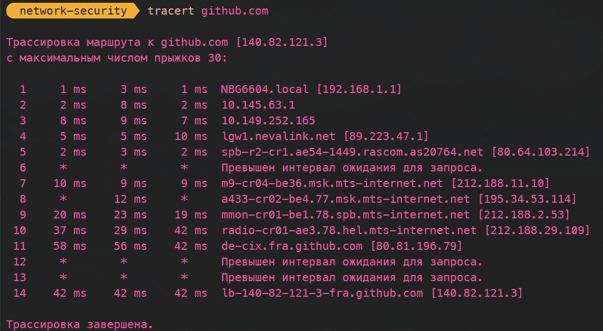

В отчете Wireshark видно множество пакетов

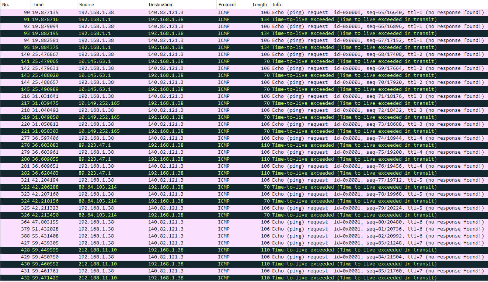

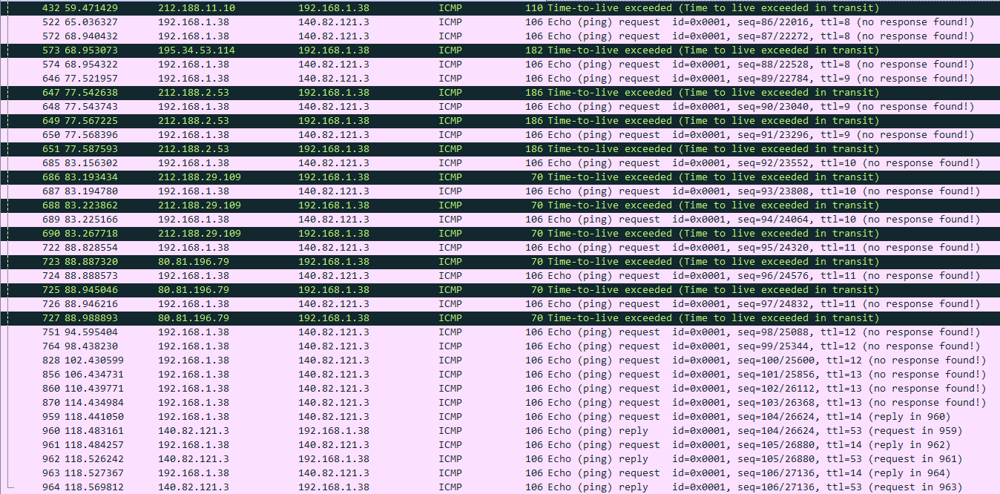

В общей сложности было зафиксировано 73 пакета (42 отправлено и 31 получено).

Далее детально рассматриваются некоторые пакеты:

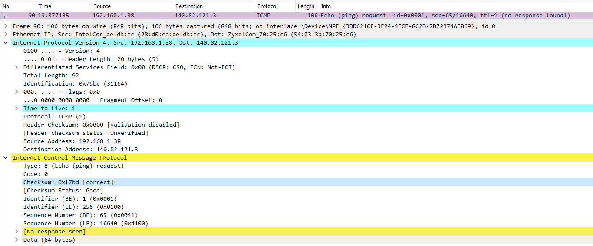

1 пакет является исходящим, имеет тип 8 (эхо-запрос) и, как и ожидалось, его TTL равен 1.

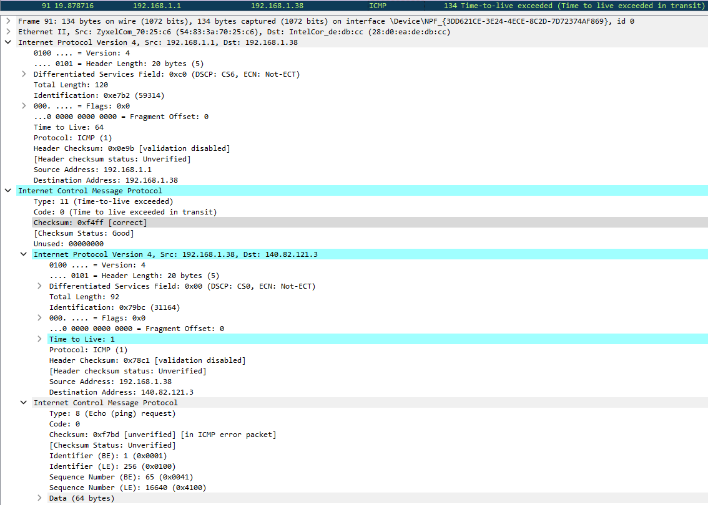

2 пакет является входящим и имеет тип 11 (истек TTL). При этом отправителем является хост с IP-адресом 192.168.1.1,
т.е. это маршрутизатор домашней сети.

Следующие 4 пакета являются абсолютно аналогичными первым двум, т.к. `tracert` отправляет 3 запроса с одинаковым TTL в
качестве контрольных выстрелов в голову.

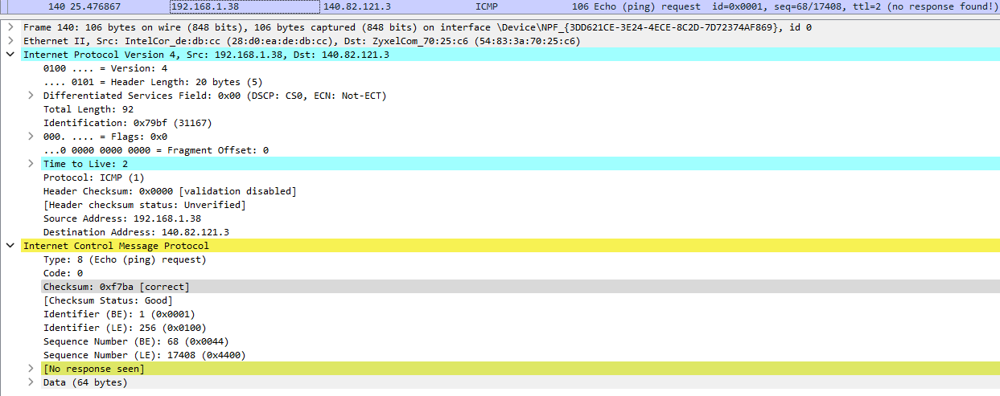

7 пакет является аналогичным 1 пакету, но его TTL равен 2.

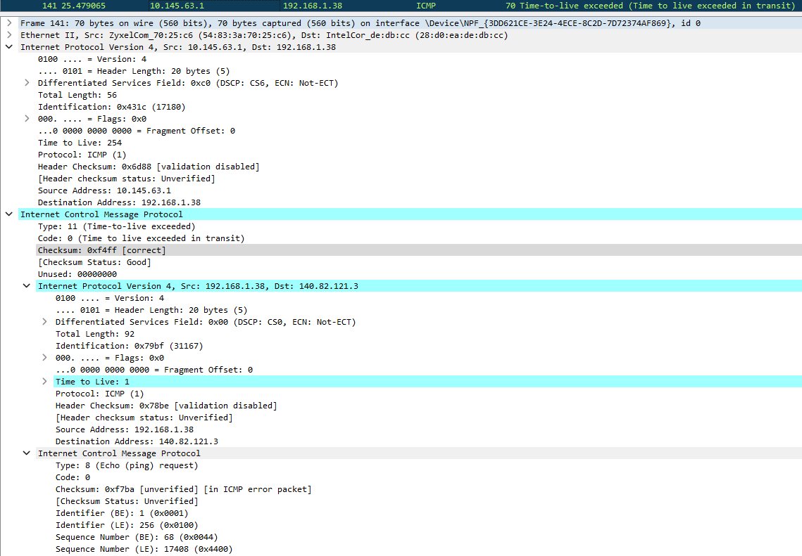

8 пакет является аналогичным 2 пакету, но его IP-адрес отправителя является `10.145.63.1`.

Не сложно догадаться, что далее процедура продолжается: отправляется 3 эхо-запроса с одним TTL, TTL инкриминируется, и
так происходит до тех пор, пока ответы на эхо-запросы начнет отправлять непосредственный адресат запросов.

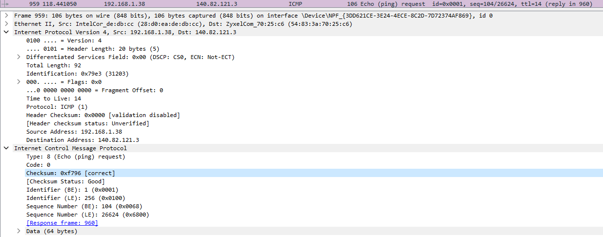

Один из последних пакетов (67) имеет TTL равный 14.

Пакет с ответом на этот запрос (68) имеет уже тип 8 – эхо-ответ, а IP-адрес отправителя – `140.82.121.3`, т.е. IP-адрес
домена `github.com`, что означает, что запрос достиг своей цели.

Последние 4 пакета являются контрольными парами запрос-ответов с таким же TTL.

Отправленных пакетов больше, чем полученных из-за того, что хосты на самом деле не обязаны отправлять что-либо при
истечении TTL, т.е. на часть запросов просто не приходило ответов.

## 4. Анализ ARP-трафика

Для передачи данных внутри сети хост должен знать MAC-адрес хоста, которому передаются данные. Для получения МАС-адреса
по известному IP-адресу используется протокол ARP, который работает в режиме запрос-ответ: запрос отправляется на
широковещательный адрес, после чего каждый хост в подсети получает этот запрос и проверяет на соответствие свой
IP-адрес, и при совпадении посылает ARP-ответ непосредственно отправителю, используя его MAC-адрес. Целью протокола ARP
является заполнение ARP-таблицы: на
приемной стороне при получении ARP-запроса, на запрашивающей стороне при получении ответа.

Для начала нужно определить, кому внутри домашней сети можно отправить ARP-запрос. Посмотреть это можно в графическом
web-интерфейсе маршрутизатора сети:

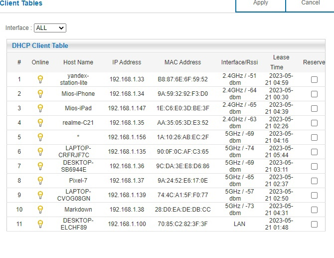

В сети имеется множество клиентов, в том числе и используемый хост с адресом `192.168.1.38`.

Попробуем определить MAC-адрес хоста с адресом `192.168.1.33`. Чтобы узнать MAC-адрес хоста, требуется отправить
ARP-запрос. Для этого можно воспользоваться командой `ping 192.168.1.33`, которая сформирует широковещательный
ARP-запрос, который можно отследить в Wireshark:

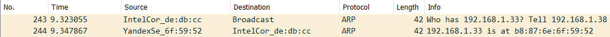

Было зафиксировано 2 запроса c типом протокола ARP.

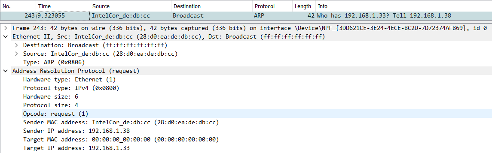

Первый пакет имеет информацию об отправителе (IP- и MAC-адреса) и IP-адрес хоста, MAC-адрес которого
требуется узнать (при этом MAC-адрес цели заполнен нулями). Также, как пакет протокола ARP, в нем
содержится поле Opcode равное 1, что означает широковещательный ARP-запрос. И действительно, в качестве получателя в
пакете указан широковещательный MAC-адрес `ff:ff:ff:ff:ff:ff`.

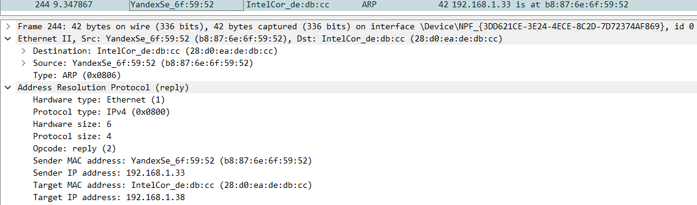

Второй пакет имеет Opcode 2, обозначающий ответ на широковещательный ARP-запрос, информацию о своем отправителе,
включая IP- и MAC-адрес (IP-адрес в данном случае тот же, на который посылался ARP-запрос, и который собственно
ожидался), и IP- и MAC-адрес получателя (в данном случае совпадает с данными хоста, с которого посылался запрос).

## 5. Анализ FTP-трафика

FTP (File Transfer Protocol) — протокол передачи файлов, который применяется для обмена файлами по TCP/IP сетям между
двумя компьютерами: клиентом и сервером. Используется транспорт TCP и передача текстовых команд, то есть в одну сторону
отправляются текстовые команды с параметрами, а в обратную сторону передаются текстовые ответы со статусами.
Поддерживается активный и пассивный режимы взаимодействия.

Соединяясь с FTP сервером допустимо пройти авторизацию предоставляя данные для входа, а также можно подключиться
анонимно, если это позволяет FTP сервер.

Основное назначение FTP протокола — это загрузка файлов и их скачивание с удалённого сервера. Для передачи файлов в
активном режиме организуется канал команд со стороны клиента, и создаётся соединение с 21 портом сервера. Когда
потребуется передача данных, сервер самостоятельно с 20 номера порта организует связь с клиентским сокетом, то есть
второй канал для данных. Данные при этом могут посылаться в обе стороны. В пассивном режиме схема похожая с активным,
только канал связи (данных) открывает 52 клиент. Номер порта у сервера каждый раз выбирается новым, и информация об этом
порте передаётся клиенту.

Подключение будет производиться к FTP-серверу `test.rebex.net` по адресу `194.108.117.16` при помощи программы WinSCP.

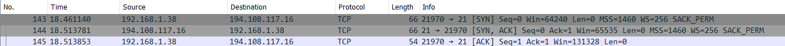

В отчете Wireshark можно видеть сегменты установления TCP-соединения. Порт клиента – 21970, а сервера – 21.

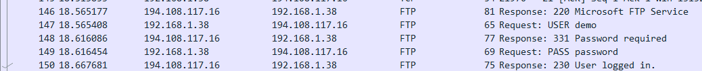

Далее в отчете следуют пакеты, смысл которых можно описать как процесс аутентификации.

- получение FTP-сообщения с кодом 220;
- отправка логина;
- получение запроса пароля;
- отправка пароля;
- получение сообщения об успешной аутентификации.

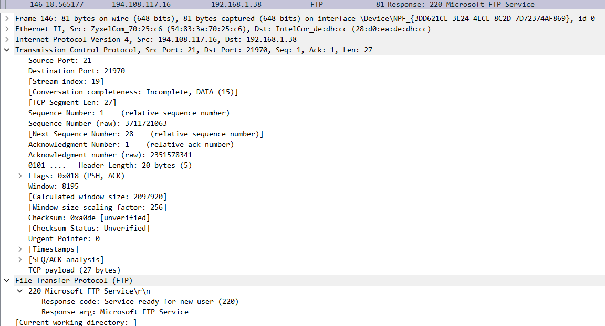

1 пакет был входящим, имел имя FTP сервера и код FTP 220, который означает готовность сервера для идентификации нового
пользователя.

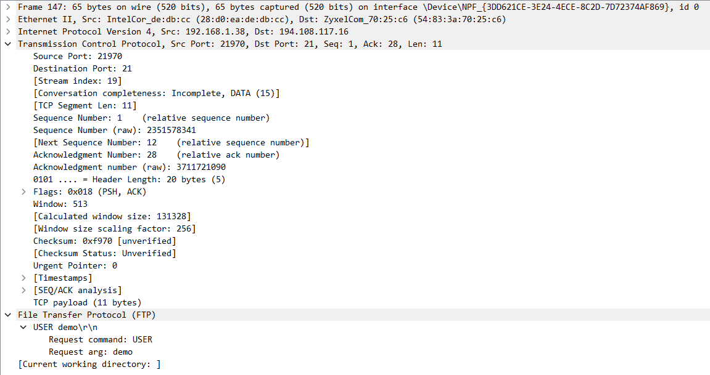

2 пакет был исходящим, имел имя пользователя для аутентификации.

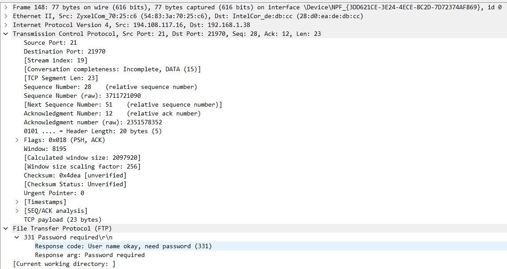

3 пакет был входящим, имел сообщение о запросе пароля для аутентификации.

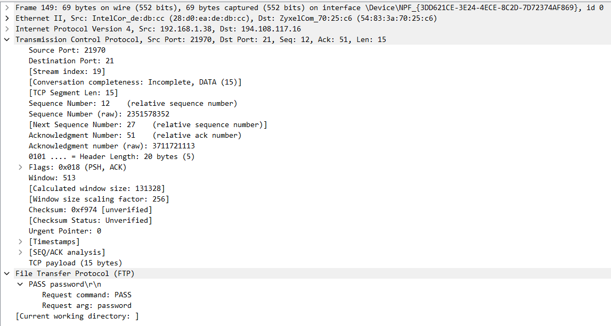

4 пакет был исходящим, имел пароль для аутентификации.

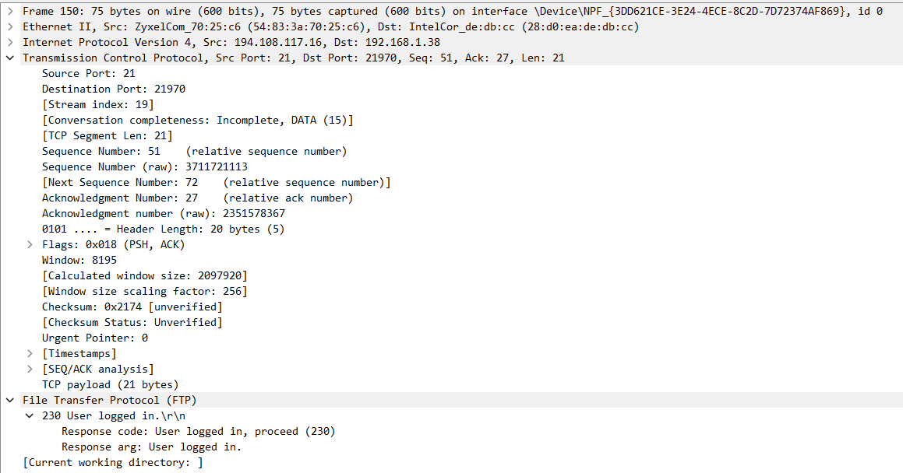

5 пакет был входящим, имел код FTP 230, который означает успешную аутентификацию пользователя.

## 6. Повышение безопасности FTP-соединения

Для повышения безопасности соединения было решено добавить в настройках подключения WinSCP явное шифрование TLS/SSL:

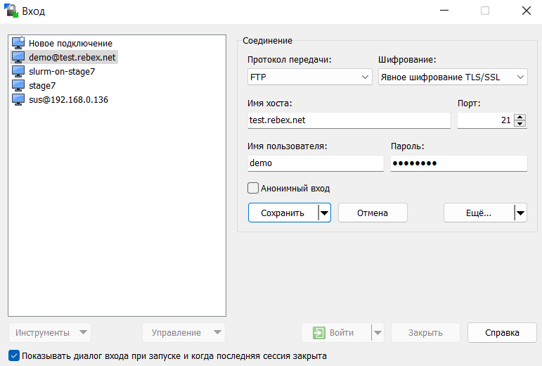

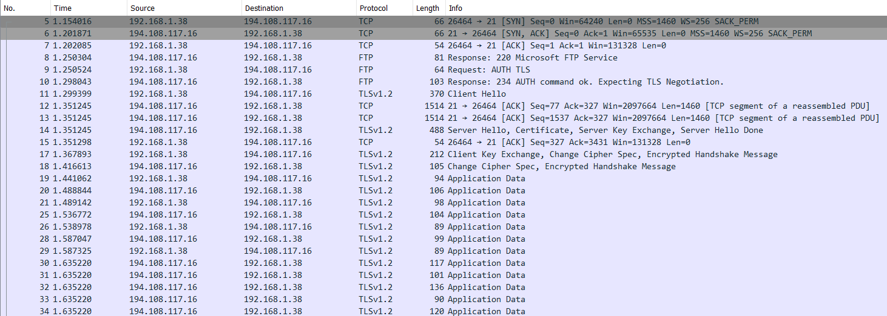

Теперь вместо идентификации поступает запрос “AUTH TLS”, который переводит FTP-сервер в режим согласования TLS. Далее
клиент уже по протоколу TLS отправляет спецификацию в виде обычного текста, а именно версию протокола, которую он хочет
использовать, поддерживаемые методы шифрования, и т.д. В свою очередь сервер утверждает версию используемого протокола,
выбирает способ шифрования из предоставленного списка, прикрепляет свой сертификат и отправляет ответ клиенту. Версия
протокола и способ шифрования на данном моменте считаются утверждёнными, клиент проверяет присланный сертификат и
инициирует обмен ключами по Диффи-Хеллману. После этого сервер обрабатывает присланное клиентом сообщение, сверяет MAC,
и отправляет клиенту заключительное `Finished` сообщение в зашифрованном виде. Клиент же расшифровывает полученное
сообщение, сверяет MAC, и соединение считается установленным, после чего начинается обмен данными приложений.

## 7. Анализ Telnet и SSH трафика

### 7.1 SSH

Для подключения по SSH использовалась команда `ssh -T git@github.com`. При этом предварительно была сгенерирована пара
ключей, и публичный ключ был добавлен в GitHub. Передача данных осуществлялась по протоколу SSHv2, который передает
данные в зашифрованном виде.

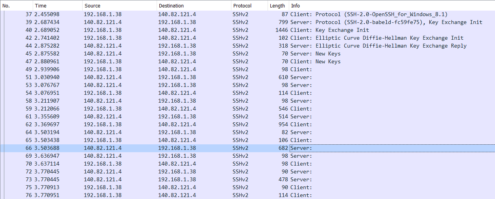

Из отчета Wireshark видно, что сначала осуществляется конфигурация используемых для обмена данными ключей для шифровки,
а затем начинается сама зашифрованная передача данных.

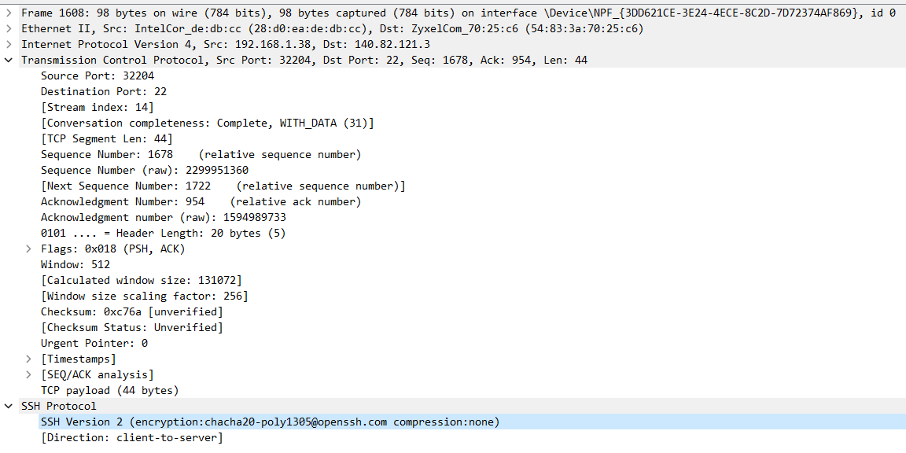

Как видно в детальной информации о пакете с данными, прочитать сами данные Wireshark не смог.

### 7.2 Telnet

Подключение по Telnet производилось к маршрутизатору домашней сети при помощи программы PuTTY. IP-адрес: `192.168.1.1`;
порт: `23` (используется Telnet по умолчанию для установки соединения).

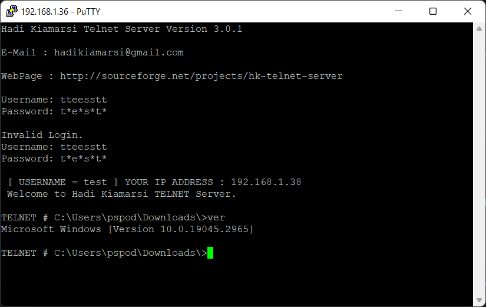

Подключившись к серверу, пройдя аутентификацию и выполнив пару команд, был полученный длинный отчет в Wireshark.

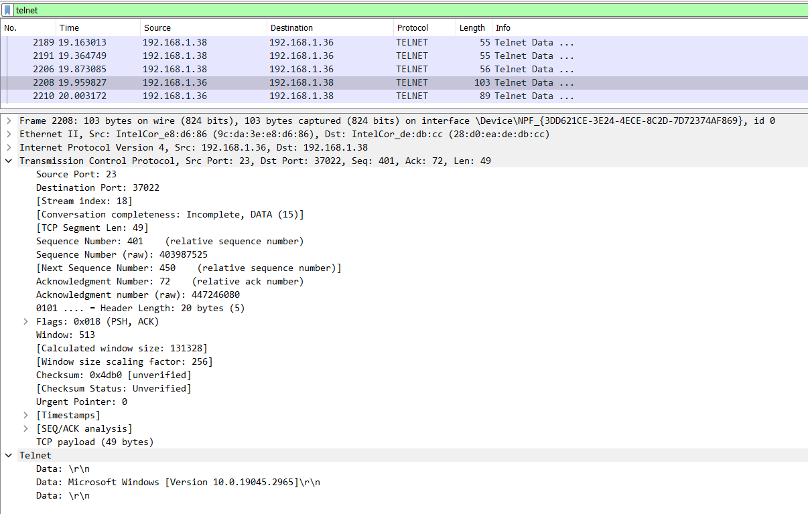

Как видно в детальном отчете, каждый пакет передается в открытом виде. Например, был найден пакет, передающий ответ на
запрос о текущей версии ОС.

## 8. Анализ TCP и UDP трафика

### 8.1 TCP

TCP (Transmission Control Protocol) – протокол транспортного уровня, реализующий надежную доставку потока данных путём
предварительного установления соединения. Имеет большую надёжность, реализуется за счёт квитирования, то есть при помощи
пакета-уведомление, который сигнализирует о том, что соответствующий пакет был получен.

Установка TCP соединения происходит в 3 этапа:

- Запрашивающая сторона (клиент) отправляет сегмент с флагом SYN, указывая номер порта сервера, к которому клиент хочет
  подсоединиться, и исходный номер последовательности клиента (предыдущий номер в буфере);
- Сервер отсылает флаг ACK с номером подтверждения принятого только что сегмента + 1 и флаг SYN также с номером очереди
  сегмента, только уже для этой стороны;
- В ответ на это клиент отправляет флаг ACK с номером принятого только что сегмента + 1.

При помощи команды `nslookup jetbrains.com` был получен IP-адрес для подключения по протоколу TCP:

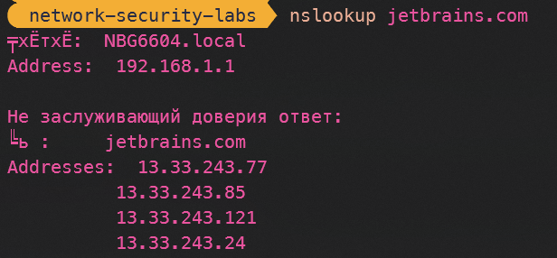

Для установки TCP-соединения по IP-адресу `13.33.243.77` и порту `80` использовалась программ PuTTY.

Wireshark отследил следующие пакеты:

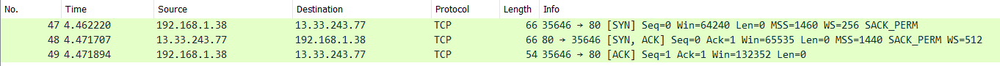

При подключении фигурирует 3 пакета:

- `SYN`
- `SYN`, `ACK`
- `ACK`

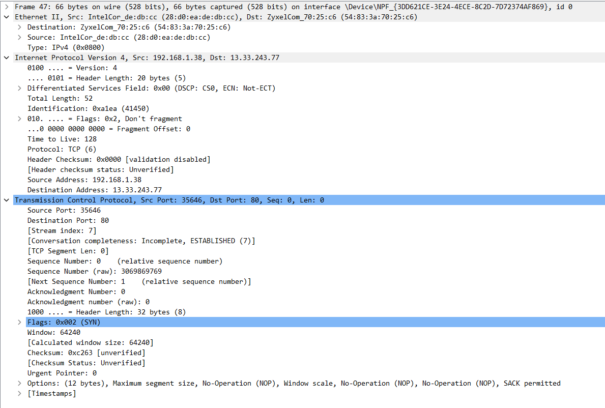

Первый пакет, который отправлен на IP-адрес `13.33.243.77`, содержит флаг `SYN`. Серверный порт – `80`, а клиентский –
`50901`, то есть непривилегированный номер порта, который выдаётся ОС. Номер последовательности и подтверждения равны 0.

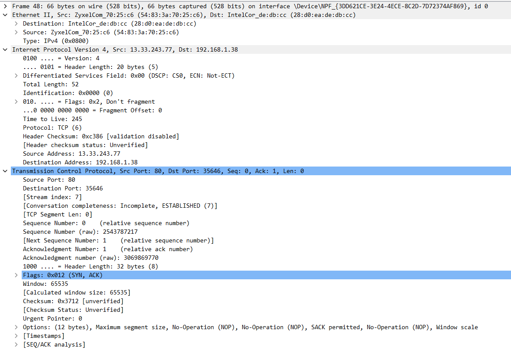

Второй пакет, который является ответом сервера на первый, имеет флаги `SYN` и `ACK`. Номер последовательности на стороне
сервера равен 0, а номер подтверждения равен номеру последовательности клиента + 1, то есть единице.

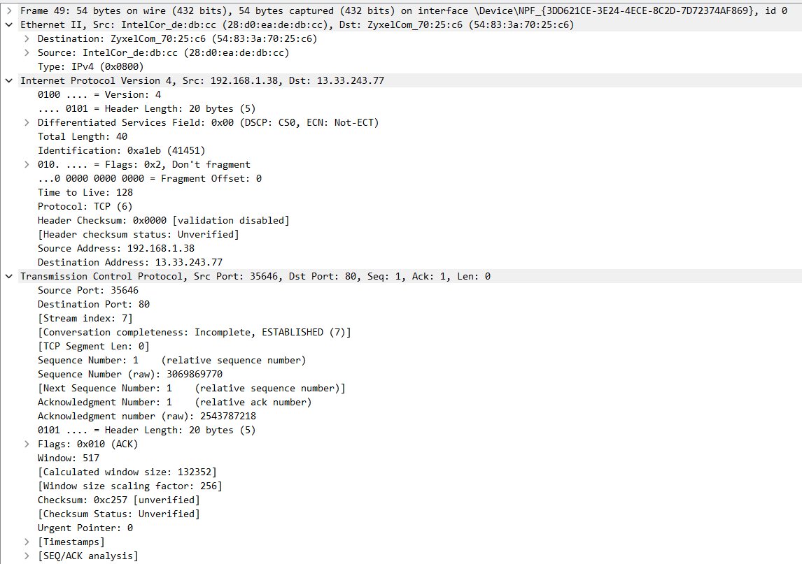

Третий пакет, отправляемый клиентом, имеет флаг `ACK`. При этом номер последовательности на стороне клиента уже равен 1,
а номер подтверждения равен номеру последовательности сервера + 1, то есть единице.

После обмена этими тремя пакетами TCP-соединение считается установленным.

### 8.2 UDP

UDP в отличие от TCP это незащищенный протокол, предполагающий самостоятельное проектирование и реализацию механизмов
защиты от потери и переотправки пакетов. UDP не требует открывать соединение, и данные могут быть отправлены сразу же,
как только они подготовлены, что ускоряет процесс передачи данных. Таким образом, UDP лучше всего использовать в
клиент-серверных приложениях, которые работают с несколькими клиентами, отправляющими небольшие запросы/ответы и
получающими такие же короткие ответы от сервера.

Для генерации UDP трафика была использована команда `nslookup -type=A jetbrains.com`. Утилита `nslookup` обращается к
DNS-серверу, посылая при этом UDP-запросы:

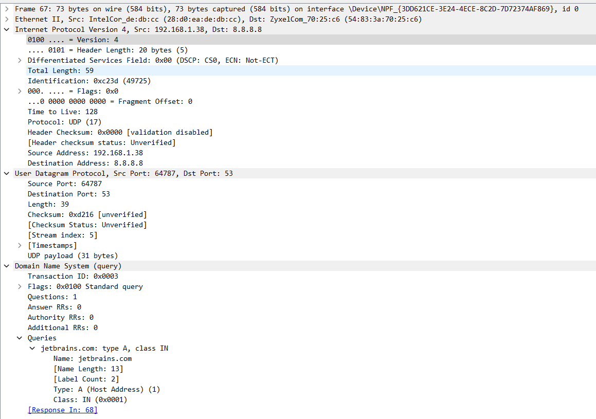

Первый пакет с запросом `nslookup` типа A с IP-адреса `192.168.1.38` и порта `64787` был отправлен на DNS-серверу по
IP-адресу `8.8.8.8` на порт `53`.

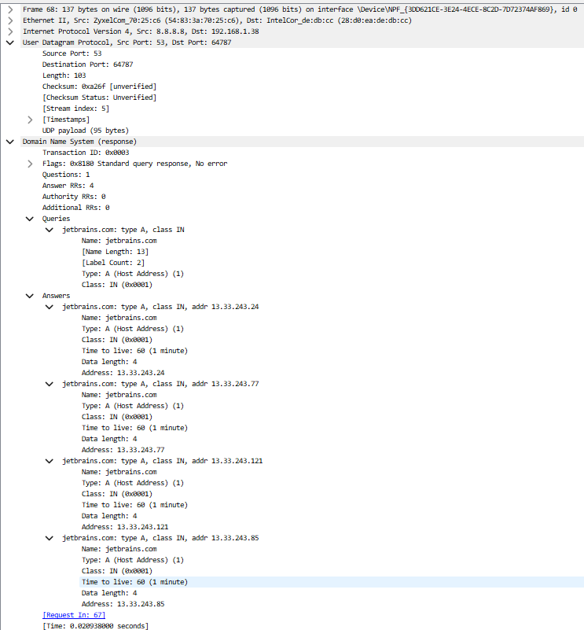

В ответ был получен пакет с информацией о 4 IP-адресах, соответствующих домену `jetbrains.com`.

## 9. Выводы

В данной работе были изучены возможности программы Wireshark по анализу трафика сети. С помощью данной утилиты был
проанализированы пакеты нескольких протоколов, а также в некоторых случаях была рассмотрена их защищённость.

# 6. Nmap network scanning

**Цель работы:** Исследование утилиты Nmap для сканирования сегмента сети.

*TODO*

# 7. Netcat and Cryptcat utilities

## 1. Цель работы

Исследование взаимодействия процессов на разных хостах с использованием утилит Netcat и её защищенного аналога Cryptcat.

## 2. Ход работы

Устройства, за которыми производилось исследование утилит, подключены с помощью Wi-Fi роутера к домашней сети. В таблице ниже преведены некоторые параметры устройств в этой сети.

| Тип               | IP адрес       |
| ----------------- | -------------- |
| Хост с OC Linux   | 192.168.31.239 |
| Хост с ОС Windows | 192.168.31.26  |

## 3. Утилита Netcat

**Netcat** — это сетевой инструмент для чтения и записи данных через сетевые подключения с использованием TCP или UDP.

### 3.1. Netcat чат

Организуем простой чат с использованием утилиты Netcat. Для этого запустим на двух  хостах два экземпляра Netcat, один из которых будет находиться в состоянии слушателя, а второй инициировать подключение с первым. Подключение будет производиться по порту 31337.

**Флаги:**

- `-l` — прослушивать входящие соединения, а не инициировать подключение к удаленному хосту.

- `-p port` — устанаваливает порт прослушивания (в нашем случае 31337).

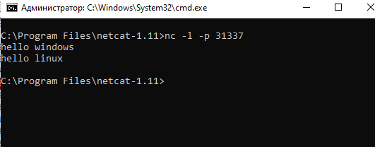

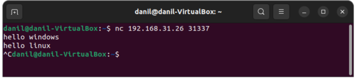

В результате на хосте с ОС Windows был запущен слушатель, к которому в последствии подключился хост с ОС Linux. На изображениях выше также продемонстрирован обмен сообщениями между двумя хостами.

### 3.2. Netcat передача файлов

Организуем передачу файлов с использованием утилиты Netcat. Попробуем передать текстовый файл с одного хоста на другой. Содержимое файла представлено на рисунке ниже.

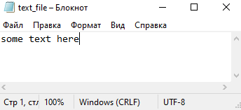

Для передачи файла запустим утилиту Netcat в режиме слушателя по порту 31337 на одном хосте и зададим передаваемый файл, после чего инициируем соединение с другого хоста для получения передаваемого файла. 

**Флаги:**

- `-v` — подробный режим отображения логов.

- `-l` — прослушивать входящие соединения, а не инициировать подключение к удаленному хосту.

- `-w timeout` — автоматически закрыть соединение, если соединение и stdin простаивают более *timeout* секунд.

- `-n` — не выполнять поиск имен через DNS

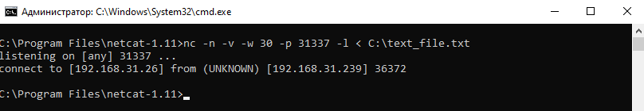

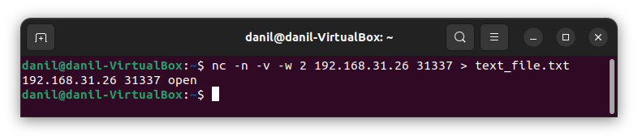

При попытке инициирования подключения у клиента появляется сообщение о том, что данный порт отркты для этого ip адреса. На стороне слушателя появилось сообщение о подключении клиента (по ip адресу видно, что подключился наш хост с ОС Linux). Спустя 30 секунд бездействия произошло автоматическое закрытие соединения. В результате файл был успешно передан.

## 4. Утилита Cryptcat

**Cryptcat**— это стандартный netcat, дополненный шифрованием twofish (симметричный алгоритм блочного шифрования с размером блока 128 бит и длиной ключа до 256 бит).

Попробуем организовать чат с использованием утилиты cryptcat, а также проанализируем трафик с помощью сетевого снифера Wireshark в случае защищенного и открытого соединений.

Принцип организации соединения остался таким же. Единственным отличием является наличие симметричного ключа.

**Флаги:**

- `-k keyword` — назначение симметричного ключа.

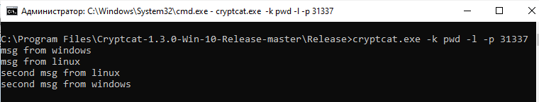

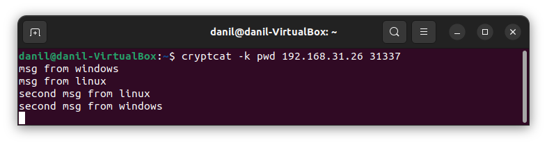

Воспользуемся сетевым снифером Wireshark и сравним трафик в случае защищенного/открытого соединения. В результате видим, что пакеты переданные с помощью утилиты netcat в заголовке data содержат сообщения в открытом виде, что показано на рисунке ниже.

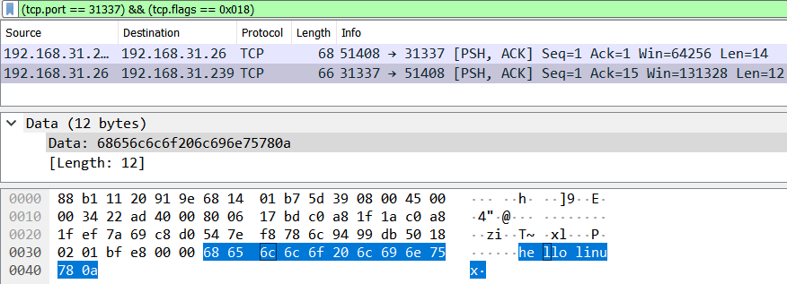

Cryptcat в свою очередь шифрует всю передаваемую информацию. На рисунке ниже показан пример зашифрованных данных в заголовке data.

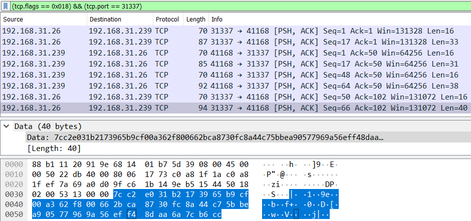

## 5. Вывод

В данной работе мы познакомились с возможностями утилиты netcat и её безопасной версии cryptcat.

# 8. Firewalls, iptables rules

## 1. Цель работы

Исследование контроля и фильтрации проходящего сетевого трафика в соответствии с заданными правилами с использованием утилиты iptables.

## 2. Ход работы

**iptables** — утилита командной строки, является стандартным интерфейсом управления работой межсетевого экрана netfilter для ядер Linux. Iptables оперирует некими правилами (rules), на основании которых решается судьба пакета, который поступил на интерфейс сетевого устройства.

### 2.1. Получение списка правил

Посмотреть текущие правила, установленные в iptables, можно при помощи команды:
`sudo iptables -L`.
Результат её работы представлен на рисунке ниже.

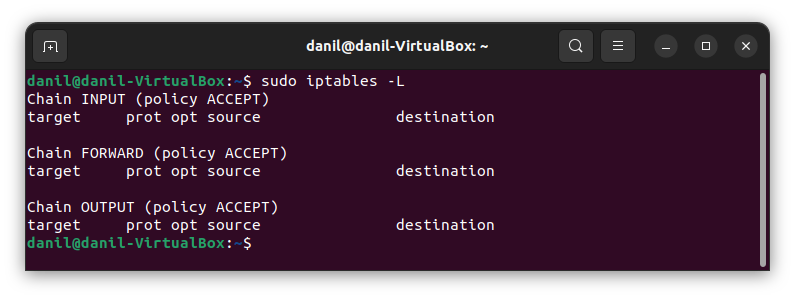

### 2.2. Блокировка всего входящего трафика

Заблокируем весь входящий трафик. Для этого воспользуемся командой: 
`sudo iptables -A INPUT -j DROP`

**Флаги:**

+ `-A chain rule-specificationУ `— добавить одно или несколько правил в конец выбранной цепочки.

+ `-j target `— определить цель правила (что делать, если пакет соответствует правилу)

На рисунке ниже представлено сосояние списка после добавления нового правила.

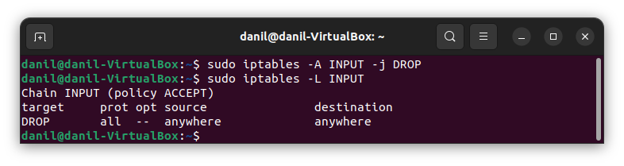

Вызова утилиты ping и использование браузера не дали результата. Число заблокированных пакетов можно увидеть на рисунке ниже.

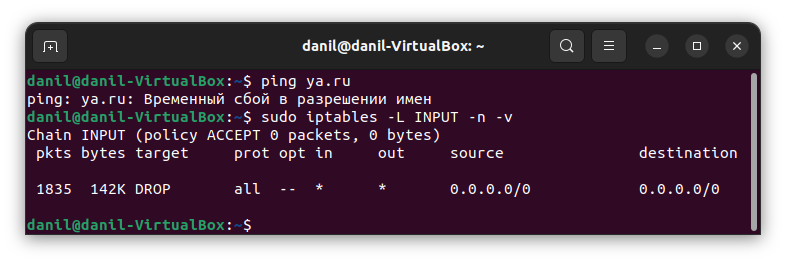

### 2.3. Фильтрация входящего трафика

Попробуем отфильтровать весь трафик так, чтобы проходил только веб-трафик. Для этого:

1. Установим **DROP** в качестве политики по умолчанию

    `sudo iptables -P INPUT DROP`

2. Разрешим трафик для loopback, чтобы внутренние сервисы нормально работали

    `sudo iptables -A INPUT -i lo -j ACCEPT`

3. Теперь разрешим TCP и UDP соединения, которые сами создаем:

    `sudo iptables -A INPUT -p tcp -m state --state ESTABLISHED,RELATED -j ACCEPT`

    `sudo iptables -A INPUT -p udp -m state --state ESTABLISHED,RELATED -j ACCEPT`

4. Разрешим работу DNS-сервиса

    `sudo iptables -A INPUT -p tcp --dport 53 -j ACCEPT`

    `sudo iptables -A INPUT -p tcp --sport 53 -j ACCEPT`

    `sudo iptables -A INPUT -p udp --dport 53 -j ACCEPT`

    `sudo iptables -A INPUT -p udp --sport 53 -j ACCEPT`

5. Разрешим http и https

    `sudo iptables -A INPUT -p tcp --dport 80 -j ACCEPT`

    `sudo iptables -A INPUT -p tcp --dport 443 -j ACCEPT`

**Флаги:**

+ `-A chain rule-specification` — добавить одно или несколько правил в конец выбранной цепочки.

+ `-P chain target `— устанавливает политику для цепочки на заданную цель

+ `-i name` — определяет имя интерфейса, через который был получен пакет

+ `-j target` — определить цель правила (что делать, если пакет соответствует правилу)

+ `-p protocol` — определяет протокол правила или пакета для проверки

+ `--state state` — определяет состояния соединения, которым нужно соответствовать
  
  + **ESTABLISHED** — пакет связан с соединением, которое просматривало пакеты в обоих направлениях
  
  + **RELATED** — пакет запускает новое соединение, но связан с существующим соединением

+ `--dport [ports]` — порт назначения является одним из заданных портов

+ `--sport [ports]` — порт источника является одним из заданных портов

Итоговая таблица правил представлена на рисунке ниже

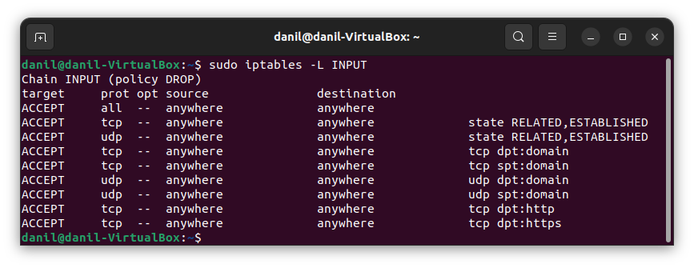

Проверим работу нашего фильтра. Для эмуляции работы WEB-сервера используем Netcat.

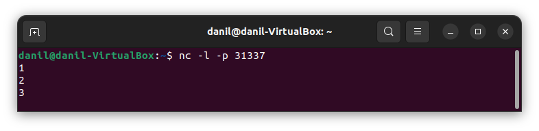

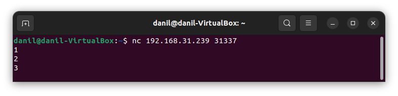

В результате видим, что передача произошла без потерь.

## 3. Вывод

В  ходе выполнения данной работы нами были изученые основные возможности управления цепочками правил при помощи утилиты iptables.

По итогам работы нами был разработан сервер защищённый от внешних подключений.

# 9. Iptables implementation

**Цель работы:** Установка правил фильтрации исходящего трафика при помощи утилиты iptables.

*TODO*

# 10. Connections Limit

**Цель работы:** Ограничение количества ssh-соединений.

*TODO*

# 11. L2, L3 Sockets sniffing

**Цель работы:** Исследование возможности RAW-сокетов предоставляющих доступ к полям заголовков
сообщений протоколов уровней L2 и L3 модели OSI.

*TODO*
